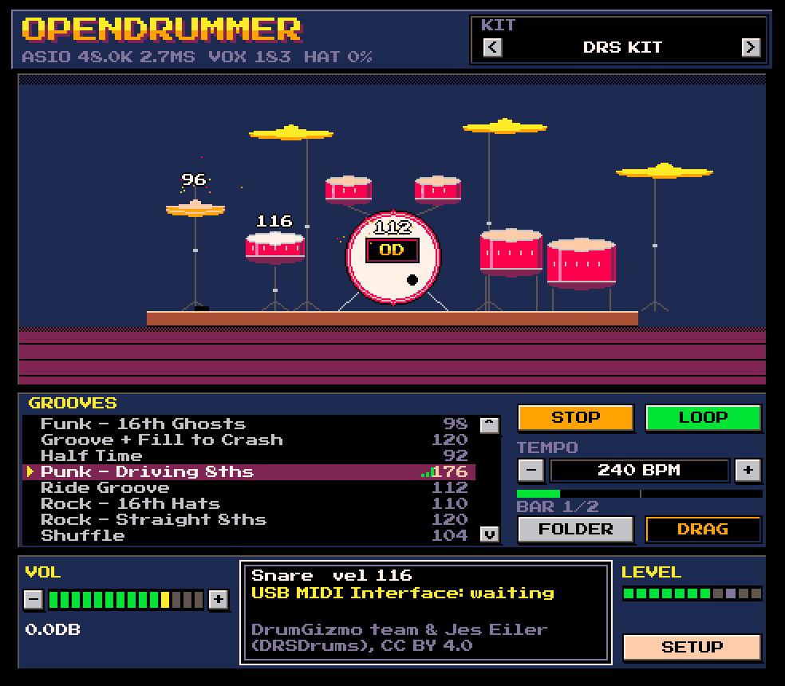

<p align="center">
  
</p>

# OpenDrummer

A drum sampler for electronic drum kits, with recorded acoustic kits and a
retro pixel-art interface. Plug in a kit, pick a drum set, play.



## What it does

- **Plays recorded drum kits** through [sfizz](https://sfz.tools/sfizz/), with
  velocity layers, round robins, microphone mixes and cymbal chokes. Three free
  kits are supported out of the box: a neutral all-rounder, a battered 1980s
  kit for punk, and a double-kick kit with a china for metal.
- **Maps an e-kit's pads to each kit.** The defaults match a Roland TD module:
  snare rim and cross-stick, tom rims, cymbal bow and edge, ride bell, the
  hi-hat pedal (CC4) and hand-choking a cymbal.
- **Plays grooves.** Eleven starter grooves are written to
  `Documents\OpenDrummer\Grooves` on first run; point it at any folder of MIDI
  files. Change the tempo, loop, or drag a groove straight into a DAW.
- **Shows you what's happening.** Pieces flash when struck and the velocity
  floats up off the drum. A MIDI line says whether your module is connected,
  sending, or hitting notes the kit doesn't know.
- **Keeps working.** Remembers your audio and MIDI devices, reconnects the drum
  module if it drops or is unplugged and replugged, and uses ASIO when it's
  available.

## Requirements

- Windows 10 or 11. OpenDrummer has only been built and tested on Windows.
- Visual Studio 2022 or Build Tools 2022, with the **Desktop development with C++** workload
- CMake 3.28 or newer, Ninja, and Git
- An electronic drum kit connected over MIDI, and an audio interface

## Building

```bat
git clone https://github.com/AlienWalker1995/OpenDrummer.git
cd OpenDrummer
build.cmd
```

The first configure downloads JUCE and sfizz, so it takes a while. The app is
written to `build\OpenDrummer_artefacts\RelWithDebInfo\OpenDrummer.exe`.

Clone to a reasonably short path, such as `C:\src\OpenDrummer`. sfizz's
dependencies nest deeply, and a long folder path can push build files past
Windows' 260-character limit, which fails with `C1083: Cannot open compiler
generated file`.
`install-shortcut.ps1` adds Desktop and Start Menu shortcuts.

### Low-latency ASIO (optional)

Without ASIO, audio goes through WASAPI, which works but adds latency you can
feel when drumming. Since October 2025 the Steinberg ASIO SDK is dual licensed,
GPLv3 or proprietary, so it is compatible with this project - but it isn't
included here. Download it from
[Steinberg](https://www.steinberg.net/developers/) and build with:

```bat
set ASIO_SDK_DIR=C:\path\to\asiosdk
build.cmd
```

## Getting the drum kits

The kits are about 3.5 GB and belong to their authors, so they aren't in this
repository. Download them into `Kits\` with:

```powershell
powershell -ExecutionPolicy Bypass -File fetch-kits.ps1
```

Kits load faster from an SSD. Each kit is several thousand small sample files,
so the first load of a kit from a hard disk can take minutes, where an SSD takes
seconds. To keep the kits on another drive, move the `Kits` folder there and add
its path to `%APPDATA%\OpenDrummer\OpenDrummer.settings`:

```xml
<VALUE name="kitsFolder" val="D:\OpenDrummerKits"/>
```

| Kit | Style | Licence |
|---|---|---|
| [DRS Kit](https://github.com/sfzinstruments/DrumGizmo.DRSKit) | Handmade kit, Paiste cymbals — jazz to rock | CC BY 4.0 |
| [Big Rusty Drums](https://github.com/sfzinstruments/karoryfer.big-rusty-drums) | Loud 1980s kit with a china — punk | CC0 |
| [MuldjordKit](https://github.com/sfzinstruments/DrumGizmo.MuldjordKit) | Double kick and a china — metal | CC BY 4.0 |

With no kits installed, OpenDrummer falls back to built-in synthesised kits so
it still makes a sound.

## Using it

| Control | Does |
|---|---|
| `<` / `>` next to **KIT** | Switch kits |
| **↑** / **↓** | Choose a groove |
| **Space** or **Enter**, or double-click a groove | Play / stop |
| Drag the **VOL** bar, or scroll over it | Volume. Double-click to reset to 0 dB |
| Drag the tempo up or down, or scroll over it | Tempo |
| **DRAG** | Drag the selected groove into a DAW as a MIDI file |
| **SETUP** | Audio and MIDI devices, velocity curve, hi-hat pedal direction, and a live MIDI monitor |

If the hi-hat opens when your foot is down, tick **Invert hi-hat pedal** in SETUP.

### When something isn't working

The MIDI line in the dialog box says which kind of problem it is:

- **waiting** — the input is open but nothing is arriving. Check the module is
  on and its MIDI OUT goes to your interface's IN.
- **unmapped** — notes are arriving on pads the kit doesn't know. SETUP's MIDI
  monitor shows the note numbers.
- **No MIDI input** — no input is selected. Open SETUP and tick your module.

While a kit loads, the header counts the seconds. The first load after starting
Windows reads every sample off the disk, so it is much slower than later ones -
on a hard disk, minutes. See `kitsFolder` above for moving the kits to an SSD.

Logs are written to `%APPDATA%\OpenDrummer\`: `devices.log` (audio and MIDI
devices found at launch), `midi.log` (MIDI inputs opened, and any that failed),
and `kits.log` (which kits folder was used, kit load times and failures).

### Offline rendering

Two command-line modes play every drum of every kit and write WAV files, for
checking kits without a drum kit or audio device:

```bat
OpenDrummer.exe --render-sampled C:\renders   :: recorded kits, through sfizz
OpenDrummer.exe --render-kits C:\renders      :: built-in synthesised kits
```

## Licence

OpenDrummer is released under the [GNU Affero General Public License v3.0](LICENSE).

It uses JUCE (AGPLv3), sfizz (BSD 2-Clause) and the Press Start 2P font (SIL
Open Font License). The drum kits keep their own licences and credits. See
[THIRD_PARTY_NOTICES.md](THIRD_PARTY_NOTICES.md).
